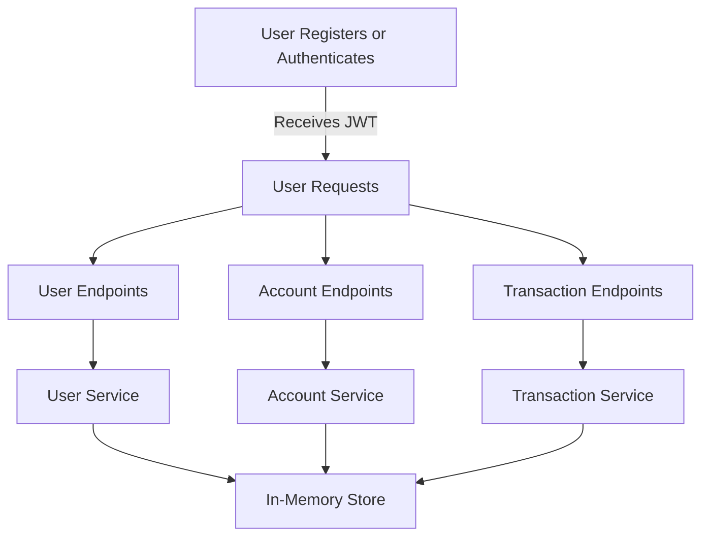

# BankingService

A Spring Boot REST API for a simple banking service, supporting user management, bank account management, and transactions with robust validation, error handling, and test coverage.

---

## Features
- User registration, update, and retrieval
- Bank account creation, update, listing, retrieval, and deletion
- Transaction creation (deposit/withdrawal) and listing
- JWT-based authentication and authorization
- Centralized validation and error handling with detailed error responses
- Comprehensive test suite

## Technology Stack
- Java 17
- Spring Boot 3
- JJWT (JWT handling)
- JUnit 5 (testing)
- Gradle (build tool)

---

## Setup Instructions

### Prerequisites
- Java 17+
- Gradle (or use the included `gradlew` wrapper)

### Clone the Repository
```sh
git clone <repo-url>
cd "Take Home Test 2/BankingService"
```

### Build the Project
```sh
./gradlew build
```

### Run the Application
```sh
./gradlew bootRun
```
The server will start on [http://localhost:8080](http://localhost:8080).

---

## API Overview

### Authentication
- **POST /v1/auth/login**: Authenticate and receive a JWT (requires existing userId)
- **POST /v1/auth/test-jwt**: Generate a JWT for any syntactically valid userId (for testing)

### Users
- **POST /v1/users**: Create a new user
- **GET /v1/users/{userId}**: Get user details (JWT required)
- **PATCH /v1/users/{userId}**: Update user details (JWT required, only self)

### Accounts
- **POST /v1/accounts**: Create a new bank account (JWT required)
- **GET /v1/accounts**: List all accounts for authenticated user (JWT required)
- **GET /v1/accounts/{accountNumber}**: Get account details (JWT required, only owner)
- **PATCH /v1/accounts/{accountNumber}**: Update account details (JWT required, only owner)
- **DELETE /v1/accounts/{accountNumber}**: Delete account (JWT required, only owner)

### Transactions
- **POST /v1/accounts/{accountNumber}/transactions**: Create a deposit or withdrawal (JWT required, only owner)
- **GET /v1/accounts/{accountNumber}/transactions**: List transactions (JWT required, only owner)
- **GET /v1/accounts/{accountNumber}/transactions/{transactionId}**: Get transaction details (JWT required, only owner)

---

## System Flow Diagram



---

## Usage Examples

### 1. Authenticate and Get JWT
```sh
curl -X POST http://localhost:8080/v1/auth/test-jwt \
  -H "Content-Type: application/json" \
  -d '{"userId":"usr-abc123"}'
```

### 2. Create a User
```sh
curl -X POST http://localhost:8080/v1/users \
  -H "Content-Type: application/json" \
  -d '{
    "name": "Alice",
    "address": {"line1": "1 Main St", "town": "London", "county": "London", "postcode": "E1 6AN"},
    "phoneNumber": "+441234567890",
    "email": "alice@example.com"
  }'
```

### 3. Create a Bank Account
```sh
curl -X POST http://localhost:8080/v1/accounts \
  -H "Authorization: Bearer <JWT>" \
  -H "Content-Type: application/json" \
  -d '{"name":"My Account","accountType":"personal"}'
```

### 4. List Accounts
```sh
curl -X GET http://localhost:8080/v1/accounts \
  -H "Authorization: Bearer <JWT>"
```

### 5. Make a Deposit
```sh
curl -X POST http://localhost:8080/v1/accounts/01000001/transactions \
  -H "Authorization: Bearer <JWT>" \
  -H "Content-Type: application/json" \
  -d '{"amount":100.0,"currency":"GBP","type":"deposit"}'
```

### 6. Withdraw Funds
```sh
curl -X POST http://localhost:8080/v1/accounts/01000001/transactions \
  -H "Authorization: Bearer <JWT>" \
  -H "Content-Type: application/json" \
  -d '{"amount":50.0,"currency":"GBP","type":"withdrawal"}'
```

### 7. Delete an Account
```sh
curl -X DELETE http://localhost:8080/v1/accounts/01000001 \
  -H "Authorization: Bearer <JWT>"
```

---

## Validation & Error Handling
- All endpoints perform strict validation on input data.
- Error responses include a top-level message and a `details` array with field-level errors:
  ```json
  {
    "message": "Invalid details supplied",
    "details": [
      { "field": "amount", "message": "Missing or invalid required field: amount", "type": "missing" }
    ]
  }
  ```
- Authorization errors and forbidden access are returned with appropriate status codes and messages.

---

## Testing
- Run all tests:
  ```sh
  ./gradlew test
  ```
- Tests cover all controllers, validation, and error scenarios.

---

## Project Structure
- `src/main/java/org/banking/service/` - Main source code
- `src/test/java/org/banking/service/` - Test suite
- `openapi.yaml` - OpenAPI spec

---

## Notes
- All data is stored in-memory (no database).
- JWTs are self-contained and not persisted.
- For demo/testing only; not production-ready.

---

**Author:** David Ozoude
**License:** MIT
